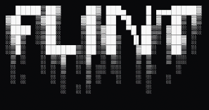
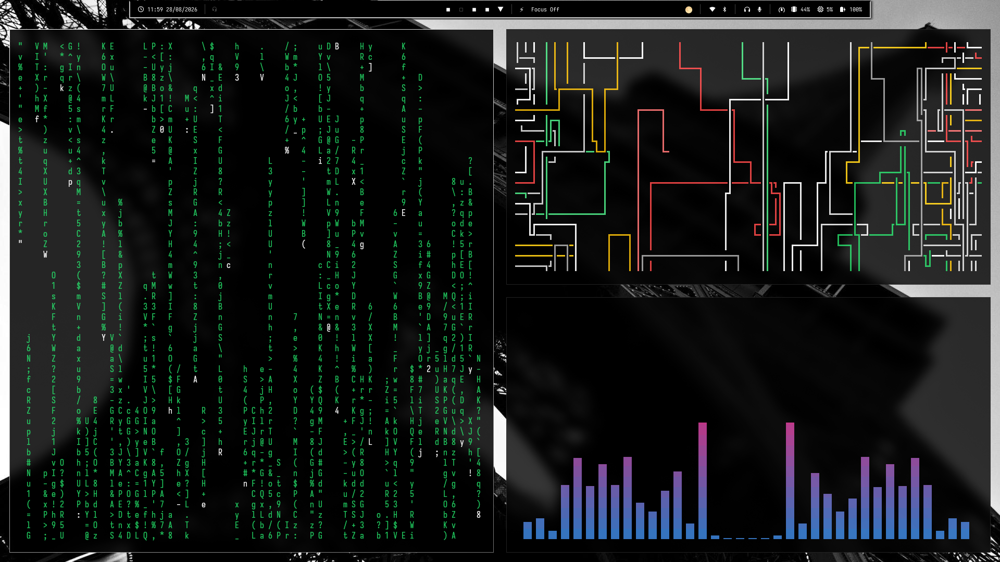
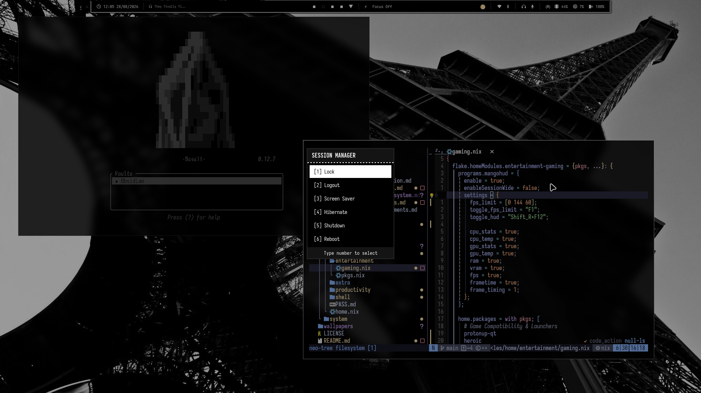
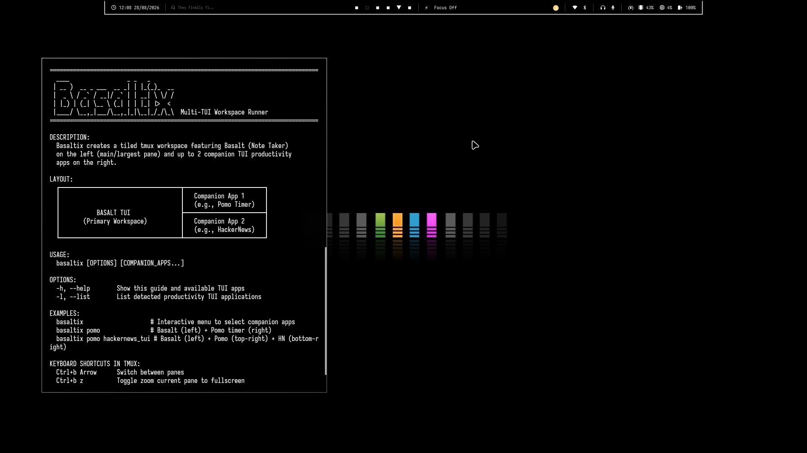

<div align="center">



### *Minimalist. Brutalist. Ultra-Responsive.*
A bespoke, dendritic **NixOS & Home Manager** workstation configured for extreme focus, zero latency, and pure OLED monochrome aesthetics.

[](https://nixos.org)
[](https://hyprland.org)
[](https://lua.org)
[](LICENSE)

---

<p align="center">
  
</p>

<p align="center">
  
  
</p>

</div>

---

## ✨ Highlights

- 🖤 **OLED Monochrome**: Pitch black and Square geometry, gives you focused workspace
- 🎮 **Interactive TUIs**: Live wallpaper picker (`SUPER + T`), physics switcher (`SUPER + A`), `basaltix` notes dashboard, and `flint-pkgs` explorer (`SUPER + P`).
- 🛠️ **Hermetic Dev Shells (`mkenv`)**: Instant 1-second isolated Nix environments for Go, Rust, TS, Python, Flutter, Zig, C, and Nix.

---

## ⚡ Quick Start

```bash
# 1. Clone to user configuration
git clone https://github.com/davindakhrisna/flint.git ~/.config/flint

# 2. Build & activate with NixOS Helper (nh)
nh os switch
# (or short alias)
nos
```

---

## ⌨️ Daily Driver Shortcuts

| Shortcut | Command / Action | Description |
| :--- | :--- | :--- |
| `SUPER + Return` | `kitty` | Launch terminal emulator |
| `SUPER + Space` | `rofi -show drun` | Application launcher |
| `SUPER + ,` | `clipboard.sh` | Fuzzy clipboard manager (`cliphist`) |
| `SUPER + .` | `rofimoji` | Emoji & Unicode glyph picker |
| `SUPER + E` | `kitty -e yazi` | Modern TUI file manager |
| `SUPER + Shift + P` | `screenshot.sh` | Region screenshot & annotation (`satty`) |
| `SUPER + G` | `gamemode.sh` | Instant game mode toggle (disable effects) |
| `SUPER + N` | `nightlight.sh` | Warm color temperature toggle (`hyprsunset`) |
| `SUPER + Escape` | `powermenu.sh` | Session power menu (Lock/Reboot/Poweroff) |

---

## 📖 Deep-Dive Documentation

Everything you need to customize, scale, and master Flint:

- [🚀 **01. Getting Started & Installation**](docs/01-getting-started.md) — Host setup, Btrfs options, and daily commands.
- [⚙️ **02. Hardware Configuration**](docs/02-hardware-configuration.md) — CPU microcode, Nvidia PRIME hybrid setup, and GPU matrix.
- [🏛️ **03. Module Architecture**](docs/03-module-architecture.md) — Dendritic auto-discovery and adding custom modules.
- [🖤 **04. OLED Monochrome Theming**](docs/04-theming-and-design-system.md) — Color tokens, geometry rules, and switchers.
- [📦 **05. Packages & Discovery**](docs/05-packages-and-modules.md) — Interactive explorer and complete package registry.
- [💻 **06. Development Environments**](docs/06-development-environments.md) — `mkenv` dev shells, CLI replacements, and Android/Waydroid.
- [🔧 **07. Troubleshooting & FAQ**](docs/07-troubleshooting.md) — Performance checklist, multi-monitor, and audio routing.

## 🚧 Work in Progress
> [!WARNING]
> Flint is actively maintained and continuously being refined:
> - **Stuttering & frame pacing** diagnostics under various workloads.
> - **Unseen edge-case bugs** across differing hardware profiles.
> 
> If you encounter any issues or glitches, please [submit an issue](https://github.com/davindakhrisna/flint/issues)!
---
## 💖 Credits & Acknowledgments
- **[HANCORE-linux](https://github.com/HANCORE-linux)** — For the awesome Waybar layout and styling inspiration used in Flint.

---

<div align="center">
  <sub>Crafted with precision for pure terminal flow. Built on <a href="https://nixos.org">NixOS</a> & <a href="https://hyprland.org">Hyprland</a>.</sub>
</div>

